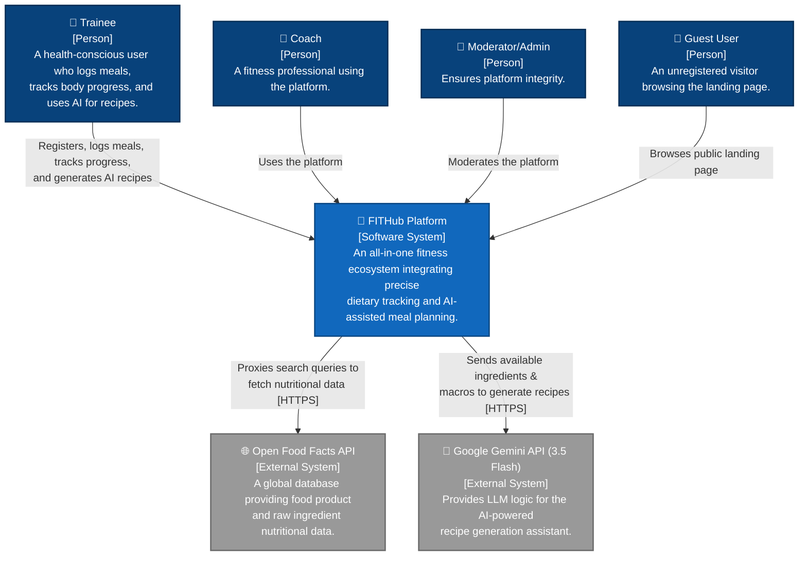
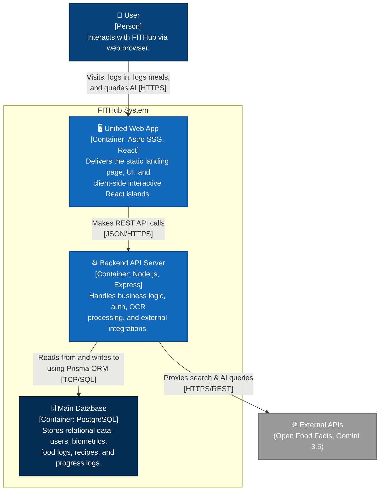
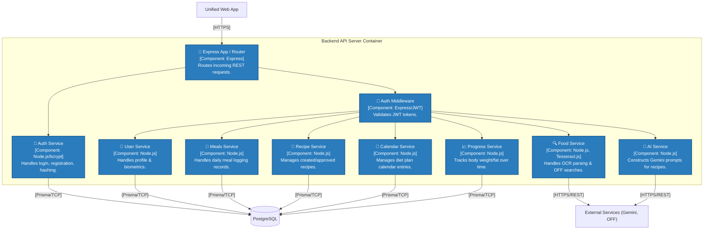
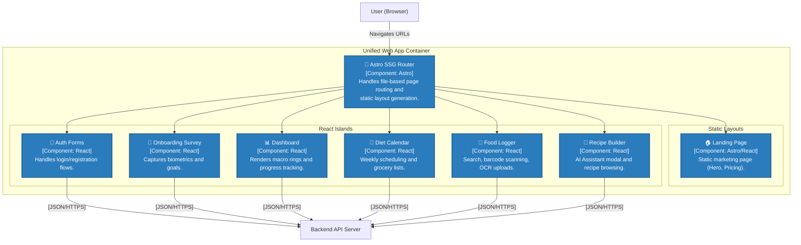

# PA4 - Software Architecture Documentation

## B-Software Architecture: System Context Diagram

**Prepared by:** [Name/ID] | **Reviewed by:** [Name/ID] | **Edited by:** [Name/ID]

### 1. Technology Stack

Based on the actual FITHub system implementation, the following technologies are utilized across the stack:

*   **Frontend (Unified Architecture):**
    *   **Astro (v6):** Serves as a Static Site Generator (SSG) providing fast, SEO-optimized static HTML layouts.
    *   **React Islands (React 19):** Used for complex, interactive UI components that are hydrated on the client side (e.g., dashboard, food logger).
    *   **Tailwind CSS (v4):** Used for building a responsive, highly dynamic, and mobile-first design using custom design tokens.
    *   **ZXing (`@zxing/browser`):** Utility libraries for client-side barcode scanning functionality.
*   **Backend (API Layer):**
    *   **Node.js with Express.js (v5.2):** Handles HTTP REST requests, routing, and business logic.
    *   **Prisma ORM (v7):** Type-safe database client and schema management tool.
    *   **Security (bcrypt & jsonwebtoken):** Handles secure password hashing and stateless JWT-based authentication.
    *   **Tesseract.js (v7):** An open-source OCR library running server-side to parse nutritional labels from images uploaded via `multer` to the local filesystem.
*   **Database:**
    *   **PostgreSQL (v15):** Relational database used for strict data linking, managing users, tracking macro aggregates, food logs, recipes, and diet calendars.
*   **External APIs & Services:**
    *   **Open Food Facts (OFF) API:** Provides raw ingredient and nutritional data when users search for foods via HTTP requests (using `axios`).
    *   **Google Gemini API (Gemini 3.5 Flash):** Provides the Large Language Model (LLM) logic for the AI assistant to generate custom recipes based on a user's remaining daily macros.

---

### 2. C4 Model - Level 1 (System Context Diagram)

The System Context diagram illustrates FITHub's overarching ecosystem, detailing the users (actors) who interact with the system and the external third-party APIs it depends on.



### 3. Diagram Explanation

*   **The System (FITHub):** Placed at the center, FITHub acts as the unified orchestrator for tracking fitness, nutrition, and generating recipes.
*   **Actors (Users):**
    *   **Trainee:** The primary end-user who utilizes the platform to track their nutrition, check progress, and interact with the AI assistant.
    *   **Coach / Admin:** Additional user roles supported by the backend role system (currently accessing standard trainee/dashboard features).
    *   **Guest User:** A prospective user browsing the unauthenticated static landing page before registering.
*   **External Systems (Dependencies):**
    *   **Open Food Facts (OFF) API:** Integrated via the backend to proxy search queries for meal tracking without exposing the frontend to CORS issues.
    *   **Google Gemini API (3.5 Flash):** Receives specific system prompts constructed on the server containing the trainee's remaining macros and available ingredients to generate JSON-formatted recipes.

---

## C-Software Architecture: Container Diagram and Component Diagram

**Prepared by:** [Name/ID] | **Reviewed by:** [Name/ID] | **Edited by:** [Name/ID]

### 1. C4 Model - Level 2 (Container Diagram)

This diagram breaks down the FITHub platform into its major executable containers, demonstrating how the frontend client interacts with the backend services and persistent storage.



#### Container Descriptions
1. **Unified Web App (Frontend):**
   * **Responsibility:** Provides the complete graphical user interface. It serves an SEO-optimized static landing page for guests and highly interactive React dashboards for authenticated users.
   * **Technology:** Astro as a Static Site Generator (SSG) for routing and layouts. React Islands for complex interactive components. Tailwind CSS for styling.
   * **Communication:** Communicates with the Backend API Server via standard HTTPS REST API calls.
2. **Backend API Server (Backend):**
   * **Responsibility:** Acts as the central brain of the application. Enforces security (JWT auth), handles local file uploads via `multer`, processes OCR for nutritional labels locally via Tesseract.js, manages recipes, and proxies external API keys.
   * **Technology:** Node.js with Express.js v5 for REST endpoints.
   * **Communication:** Receives HTTPS requests from the frontend, queries PostgreSQL via Prisma ORM over TCP, and makes secure HTTPS requests to external services like Gemini and Open Food Facts.
3. **Main Database:**
   * **Responsibility:** Persists all structured, relational application data ensuring strict data integrity.
   * **Technology:** PostgreSQL v15.
   * **Communication:** Communicates with the Node.js API server via TCP connections using Prisma ORM.

---

### 2. C4 Model - Level 3 (Component Diagram: Backend API Server)

This diagram zooms into the **Backend API Server** container to reveal its internal modular service structure as implemented in the codebase.



#### Backend Component Descriptions
*   **Express App / Router:** The single entry point for all incoming HTTP requests. Parses endpoints and JSON payloads (with 50MB limits for base64 images) and forwards them to controllers.
*   **Auth Middleware:** Intercepts protected routes to verify JSON Web Tokens (JWT) extracted from the `Authorization` header.
*   **Auth Service:** Manages registration and login flows, including securely hashing passwords with `bcrypt`.
*   **User Service:** Manages onboarding logic, BMR/macro calculations, and user biometric tracking.
*   **Food Service:** Proxies search requests to the Open Food Facts API and runs local Tesseract.js OCR to extract text from uploaded nutrition label images.
*   **Meals Service:** Handles CRUD operations for users logging specific meals and macro intakes on a given date.
*   **AI Service:** Securely constructs system prompts by injecting user macros/ingredients, and handles the API request/response cycle with Gemini 3.5 Flash.
*   **Recipe Service:** Manages the creation, status (Private/Pending/Approved), and storage of recipes and their ingredients.
*   **Calendar & Progress Services:** Manage weekly diet scheduling entries and body progress tracking (weight/fat percentage) over time.

---

### 3. C4 Model - Level 3 (Component Diagram: Unified Web App)

This diagram zooms into the **Unified Web App** frontend container to reveal how the client-side Astro/React architecture is structured.



#### Frontend Component Descriptions
*   **Astro SSG Router:** Handles top-level file-based routing (`src/pages`). It pre-renders static HTML layouts at build time, serving them directly to the user.
*   **Landing Page:** Pure HTML/CSS static pages optimized for SEO and instantaneous load times.
*   **Auth Forms & Onboarding Survey:** React-based components handling local form state, validation, and JWT token management (stored in `localStorage`) during login and initial biometric setup.
*   **Dashboard UI:** A heavily interactive React module responsible for rendering complex SVG charts (Macro Rings, Progress Bars) and fetching daily summaries.
*   **Food Logger UI:** Manages the camera/upload interface for OCR, handles ZXing barcode scanning, and provides a search interface querying the backend.
*   **Recipe & Diet Plan UIs:** Contains the AI Assistant modal leveraging Framer Motion for animations (if added) or CSS transitions, allowing users to generate recipes and schedule them on a calendar component.

---

## D-Deployment Diagram

**Prepared by:** [Name/ID] | **Reviewed by:** [Name/ID] | **Edited by:** [Name/ID]

This section maps the FITHub software containers to the infrastructure nodes they will run on in a production environment.

```mermaid
flowchart TD
    %% Cloud Environment
    subgraph Cloud Infrastructure [Production Cloud Environment]
        
        %% Frontend Node
        subgraph CDN Node [Static Hosting / Edge CDN]
            Frontend["🖥️ Unified Web App\n[Static HTML/JS/CSS]"]
        end

        %% Backend Node
        subgraph App Node [Application Server / Node.js]
            NodeServer["⚙️ Backend API Server\n[Express v5]"]
        end

        %% Database Node
        subgraph DB Node [Managed Database]
            Postgres[(🗄️ PostgreSQL v15)]
        end
    end

    %% External Services
    Gemini["🧠 Gemini API"]
    OFF["🌐 Open Food Facts"]
    Client["📱 User Device\n(Web Browser)"]

    %% Network Connections
    Client -- "1. HTTPS (Fetches Static Assets)" --> Frontend
    Client -- "2. HTTPS (REST API Requests)" --> NodeServer
    
    NodeServer -- "3. TCP / pg port 5432" --> Postgres
    NodeServer -- "4. External Proxy [HTTPS]" --> Gemini & OFF

    %% Styling
    classDef node fill:#e8f4f8,stroke:#0b4884,stroke-width:2px,color:#000000
    classDef container fill:#1168bd,stroke:#0b4884,stroke-width:2px,color:#ffffff
    
    class CDN Node,App Node,DB Node node
    class Frontend,NodeServer,Postgres container
```

### Infrastructure Node Descriptions

1. **Static Hosting / Edge CDN (e.g., Netlify, Vercel, or AWS S3+CloudFront):**
   * **Hardware/Cloud Service:** A distributed Content Delivery Network (CDN) optimized for serving pre-built static files.
   * **Containers Deployed:** The Unified Web App (Astro SSG build output containing HTML, CSS, and compiled React bundles).
   * **Communication:** Serves static assets to the user's browser via HTTPS.
2. **Application Server (e.g., AWS EC2, Render, Heroku):**
   * **Hardware/Cloud Service:** A virtual server instance running the Node.js runtime.
   * **Containers Deployed:** The Node.js Backend API Server (Express).
   * **Communication:** Receives HTTPS REST API traffic directly from the user's client device. Connects to the database via TCP. Makes outbound HTTPS requests to external APIs.
3. **Managed Database (e.g., AWS RDS, Supabase):**
   * **Hardware/Cloud Service:** A managed relational database instance providing automated backups, scaling, and high availability.
   * **Containers Deployed:** PostgreSQL Database.
   * **Communication:** Listens for secure TCP connections (standard port 5432) originating exclusively from the Application Server.

---
