## A - Group Registration
*Performed by: Nguyễn Minh Trí, Reviewed by: Nguyễn Thúy Hằng, Đào Hưng Khoa, Edited by: Đào Hưng Khoa*

 - As per registration form. 

## B - Project Proposal
*Performed by: Nguyễn Duy Đức, Reviewed by: Nguyễn Thúy Hằng, Đào Hưng Khoa, Edited by: Đào Hưng Khoa*

### 1. Introduction
* **FITHub** is a web application that combines multiple health-centric functionalities to help users gain autonomy over their fitness and well-being. By bridging the gap between traditional workout/diet tracking and professional coaching approaches, our app aims to provide a more complete solution to health (both mental and physical) and fitness. 

### 2. Target Users and Environments
* **Target Users:** 
  * Individuals aiming to keep fit, bulk, cut, or maintain weight.
  * Individuals seeking to manage health conditions (for example: diabetes, cardiovascular conditions,...) through diet and exercise.
  * Certified Coaches/PTs looking to manage clients and share their expertise.
* **Environments:** Our application will be a web app (specifically a PWA, with possible future expansion to native mobile app form). 
  * Trainees and Coaches will primarily use mobile web browsers for on-the-go tracking. 
  * Moderators and Admins will utilize desktop web browsers for efficient data management, dashboard viewing, and user verification.

### 3. Key Features (Functional Groups)

* Our app currently is planned to have 4 different roles: Normal users (Trainees), special users (Coaches), moderators, and administrators.
#### Below is our app's key functional groups:
**i. Nutritional tracking**
This functional group provides users with the tools to monitor their food intake and nutritional goals.
*   **Food/Meal logging:** Users can search a comprehensive database to manually log individual ingredients or entire meals they have consumed throughout the day. This provides users with strict autonomy and accuracy over their dietary targets.
*   **Visual macro/micronutrient dashboard:** The app displays daily progress using charts (pie charts, progress bars) for macronutrients (protein, carbs, fats) and specific micronutrients. This allows users, especially those managing health conditions (like diabetes), to easily understand their remaining nutritional goals.
*   **Camera-based logging:** Users can use their device's camera to snap a photo of their food labels, which the app will analyze to automatically input the nutritional data. This reduces the friction for manual data entry, making logging more convenient for users.

**ii. Diet plan management**
This group focuses on the scheduling, creation, and sharing of daily diet plans.
*   **Diet calendar:** Diet plans are visualized in a calendar format where users can view, check off, or modify their scheduled meals for the week. This provides a clear timeline of their diet, and progress.
*   **Recipe templates:** Users can create their own custom meal recipes, save them as private templates to use later, or submit them to a public database, where, after approval from moderators, these templates/recipes can be used by other users. The moderation approval system ensures that the recipes are high-quality, and are free of fake/harmful recipes. 
*   **AI-powered recipe generation (AI feature):** 
	* Users can interact with an AI chatbot agent to curate recipes based on their remaining daily macros and serving sizes. Instead of having to manually figure out what to eat for dinner based on what ingredients they have left, the AI can provide safe, and logical tailored suggestions based on our nutritional database combined with the users' actual needs (satisfy nutritional goals) and constraints (users that need/wish to make do with what they actually currently have in the fridge). This will help users reduce cognitive load in having to think of satisfactory recipes on a budget/constraint, and help users reduce waste and unnecessary spending by helping them make use of what they actually have.
	* For example, a user can ask: "I only have 2 chicken breasts, white rice, kimchi, 2 eggs, and ... .What do you think i should eat based on the ingredients i still have in my fridge, and based on my remaining macro tallies for the day?", after which the AI will instantly respond with recommended recipes, recommend serving sizes, other relevant advice, and adjust daily macronutrient tallies (if the user agrees to use said recipe). 
	* This ensures that there will be no overlap between the duties of a coach and of the AI agent, and it eliminates the potential harm of inaccurate health advice from AIs, as the recipe will have to stick to the user's specific nutritional needs and the app's food/nutritional database. 

**iii. Coach Marketplace & Matchmaking**
This functional group acts as a bridge between trainees and coaches.
*   **Coach recommendations:** Utilizing data from the user's initial onboarding survey (health markers, goals, medical history), the system recommends specific coaches who specialize in those exact needs. This prevents beginners from feeling overwhelmed and helps them find the right professional guidance instantly.
*   **Coach browsing & review system:** Trainees can browse a directory of certified coaches, view their descriptions, and read verified reviews left by previous clients. This rating system empowers users to make informed financial decisions and prevents abuses of power by coaches.
*   **Coach bookmarking:** Users can "pin" or save their favorite coach profiles to a dedicated list. This allows users to compare multiple trainers over time before committing to one person's coaching services.

**iv. 1-on-1 Coaching portal**
Once a trainee hires a coach, this functional group provides the workspace for their professional relationship.
*   **Custom plan assignment:** Coaches can create and directly send customized fitness routines and specific meal instructions to a trainee's personal calendar. This allows trainers to actively manage their client's regimen without relying on external spreadsheets.
*   **Progress monitoring:** Coaches are granted access to view their client's daily logged meals, macro completions, and biometric updates. This centralized data allows coaches to evaluate if a client is adhering to the plan and make real-time adjustments.
*   **Direct messaging:** The portal features a built-in chat system for direct communication between the coach and trainee. This replaces the need for third-party messaging apps, streamlining a user's fitness journey.

**v. Platform Moderation & Administration**
This group contains the essential tools for Admins and Moderators to maintain platform integrity and safety.
*   **Coach verification:** Moderators can review submitted personal IDs and coaching certifications from users applying for the "Coach" role. This ensures that only qualified people are allowed to charge trainees for services, maintaining the app's credibility.
*   **Community recipe moderation:** Admins and Mods review user-submitted recipes before they are pushed to the global app database. This prevents the public database from being flooded with inaccurate/harmful nutritional entries.
*   **Affiliate Link & Content Management:** Admins can manage the display of popular dishes, coach affiliate links, and other monetization elements on the platform. This provides the admins with the tools necessary to maintain the business logic and revenue streams of the app.

### 5. AI Feature
*   **AI-powered recipe recommendations:** *see the third feature of B.3.ii*:
	* Users can interact with an AI chatbot agent to curate recipes based on their remaining daily macros and serving sizes. Instead of having to manually figure out what to eat for dinner based on what ingredients they have left, the AI can provide safe, and logical tailored suggestions based on our nutritional database combined with the users' actual needs (satisfy nutritional goals) and constraints (users that need/wish to make do with what they actually currently have in the fridge). This will help users reduce cognitive load in having to think of satisfactory recipes on a budget/constraint, and help users reduce waste and unnecessary spending by helping them make use of what they actually have.
	* For example, a user can ask: "I only have 2 chicken breasts, white rice, kimchi, 2 eggs, and ... .What do you think i should eat based on the ingredients i still have in my fridge, and based on my remaining macro tallies for the day?", after which the AI will instantly respond with recommended recipes, recommend serving sizes, other relevant advice, and adjust daily macronutrient tallies (if the user agrees to use said recipe). 
	* This ensures that there will be no overlap between the duties of a coach and of the AI agent, and it eliminates the potential harm of inaccurate health advice from AIs, as the recipe will have to stick to the user's specific nutritional needs and the app's food/nutritional database. 

## C - Existing App Survey
*Performed by: Nguyễn Duy Đức, Reviewed by: Nguyễn Minh Trí, Edited by: Đào Hưng Khoa*

* We've decided to survey these existing apps that are similar to our proposed project: MyFitnessPal, Cronometer, Trainerize.

### 1. MyFitnessPal

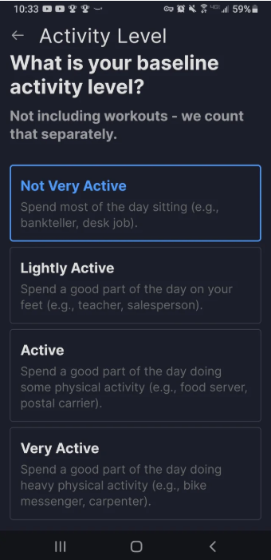
  * ***Image C.1.1.** This screen shows the initial user survey where users will input their height, weight, goal weight, and activity level (where the survey is currently at in the screenshot).*
  * This app uses this biometric data to automatically generate a daily caloric target. 

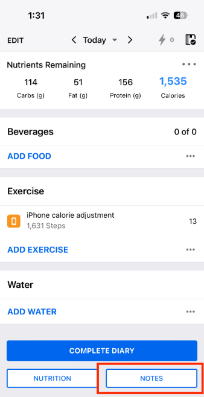
  * ***Image C.1.2.** The main "Diary" interface displaying sections for Breakfast, Lunch, and Dinner.* 
  * Here, users search for food items to log. The top banner calculates remaining calories (goal calories/macros - consumed calories/macros at any given point in the day), providing a clear, real-time summary of the user's daily progress.

### 2. Trainerize (Fitness planning & Coach-Trainee interaction)

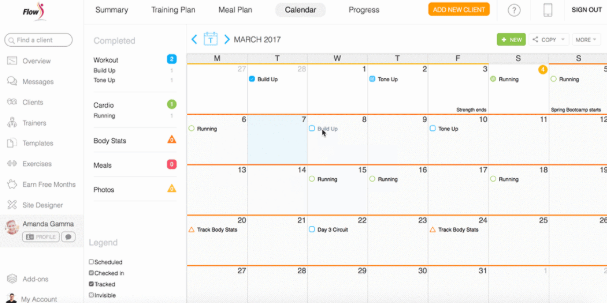
  * ***Image C.2.1.** The calendar dashboard from the trainee's perspective, showing each day's planned activity as decided on by the coach.* 
  * Coaches can schedule specific workout routines, cardio goals, or meal habits on specific days. The trainee checks them off as completed, giving both parties a visual timeline.

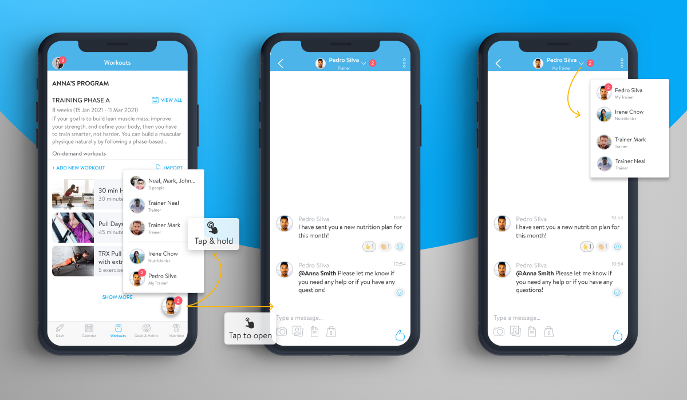
  * ***Image C.2.2.** The 1-on-1 messenger system for coaching.* 
  * This acts as a centralized communication hub where coaches can evaluate progress photos, send quick reminders, and answer trainee questions without relying on third-party messenger apps, streamlining coaching for both coaches and trainees.

### 3. Cronometer (Focus: Micronutrient Accuracy & Desktop UI)

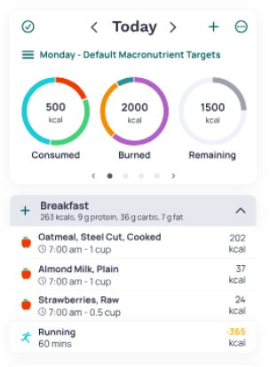
  * ***Image C.3.1.** The daily logging screen showing detailed nutritional charts.* 
  * Cronometer is like MyFitnessPal for basic macros, but it also visualizes micronutrient targets, which are just as important as macros for health. This is relevant for users managing health conditions and other dietary constraints/demands.

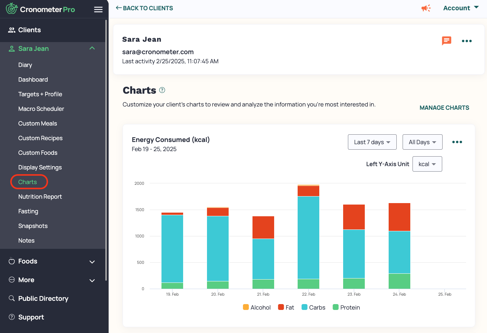
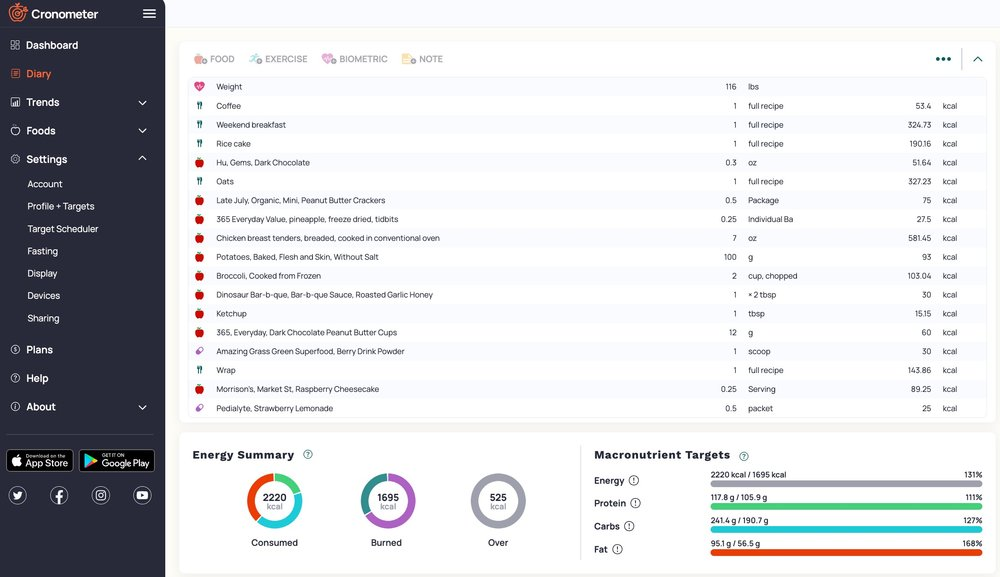
  * ***Images C.3.2-3.** The desktop web dashboard of the Cronometer app (pro version).* 
  * They display more complex trends, charts, over time, and allow easier logging with the bigger screen. 

### Summary & comparison

**1. What features these existing apps have in common:**
* **User data foundations:** all three apps rely on an initial survey of the user’s biometrics to establish baseline targets
* **Calendar-based tracking:** They all utilize a diary or calendar-based system to organize data day-by-day, allowing users to look back at historical data or look forward to planned routines.
* **Visual Progress Indicators:** Progress is universally displayed using visual components like progress bars, pie charts (for macros), and ring gauges.

**2. What our app will improve upon:**
* **A more general, complete solution:** existing market solutions are heavily fragmented, MyFitnessPal and Cronometer are excellent for food tracking but offer no support for hiring and interacting with a coach/PT. On the other hand, Trainerize provides coach-trainee interaction and support but requires coaches to ask clients to track food on other 3rd-party apps (like MyFitnessPal), adding another layer of confusion/complexity. 

*  **Our solution:**
	* We combine the dietary tracking of Cronometer/MyFitnessPal with the coaching functionalities of Trainerize.
	* **Community database with moderation:** Unlike MyFitnessPal, where the public database is filled with inaccurate, duplicate user entries, we will implement a moderator-approval system for community recipes, ensuring high quality recipes.
	* **AI integration:** None of the surveyed apps feature an integrated, conversational AI that automatically curates real-time recipes and adjusts serving sizes to perfectly fit a user's remaining daily macros. 

**3. Which UI/UX patterns we plan to adopt:**
* **From MyFitnessPal:** The step-by-step onboarding survey. 
* **From Trainerize:** The interactive calendar UI for diet plans. 
* **From Cronometer:** We will adopt Cronometer's clean, dense data tables and charts for our app, while keeping the mobile views streamlined and focused on quick inputs.

## D - Team Contract
*Performed by: Nguyễn Minh Trí, Reviewed by: Nguyễn Phúc Bảo Phúc, Edited by: Đào Hưng Khoa*

**1. Team Roles and Responsibilities**
* **Project Manager / Scrum Master:** Manages Trello, schedules Scrum meetings, ensures Sprints stay on track.
* **UI/UX lead:** Leads UI/UX prototyping (Figma/Stitch).
* **Frontend lead:** Oversees React/Next.js architecture and state management.
* **Backend lead:** Designs the database, handles server logic and API usage.
* **QA/QC lead:** Manages testing procedures.
*  **Business Analyst (BA):** Acts as the bridge between the target demographic and the development team. Responsible for detailing functional/non-functional requirements, writing use cases, and ensuring the final product effectively meets the users' fitness goals.
*  **Systems Designer:** Responsible for designing the overarching software architecture, structuring the database schemas (relationships between users, coaches, recipes,... ), and mapping out system workflows and API endpoints.
*  **Systems Engineer:** Focuses on infrastructure, integrations, and bringing the system components together. Responsible for setting up the hosting environment, managing the deployment pipeline, ensuring system performance, and securely integrating third-party services.

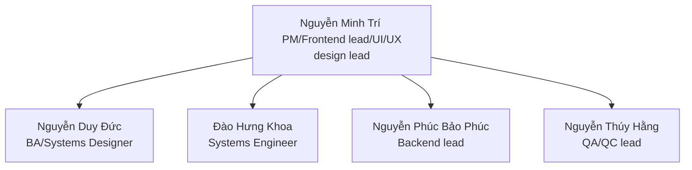
*
Diagram 1: Team 3 roles

**2. Communication Plan**
* **Primary tool:** Messenger (for quick daily chats) and Discord (for voice calls/pair programming).
* **Meetings:** weekly Scrum meetings (flexibile time, usually Thursday afternoon) on Discord.
* **Expectations:** messages in the main messenger group must be acknowledged within 24 hours.

**3. Work Schedule and Deadlines**
* **Project milestones & deadlines:** consistent with PAs (PA1-5) assigned on Moodle.
* **Availability**: each team member is expected to be available for all weekly meetings and agreed upon work sessions (unless given prior adequate reasoning for absence at least 1 day in advance). 
* **Contingency:** if a member misses a deadline, a free/available team member will pair up with the other member to recover lost time. If no members are available, the PM or the backend lead will be expected to help the other member recover lost time (unless decided upon otherwise by the project lead).

**4. Code and Documentation Standards**
* **Coding:** Variable names must be understandable, code comments should be made in English.
* **Git:** Feature-branch workflow (`feature/add-survey`, `bugfix/calendar-ui`). 
* **Reviews:** All Pull Requests (PRs) require at least 1 approval from another team member before merging into `main`.
* **Documentation:** Written in Markdown. Mermaid syntax used for architectural diagrams.

**5. Accountability and Performance**
* Contribution is measured by completed Trello story points and successful PRs. 
* If a member underperforms and/or fails to communicate for 48 hours without notice, the PM/Project lead will issue a warning and deduct points as seen necessary/suitable. Repeated offenses will be discussed as a group and escalated to the TA if no resolution is found.
* If a team underperforms (and fails to communicate underperformance prior to a deadline), responsibility will fall upon the team lead unless there is a valid reason for underperformance. If there is a valid reason, consequences and responsibility will be discussed as a group, and escalated to the TA if no resolution is found. 

**6. Decision-Making Process**
* We utilize a majority-vote system for technical and design decisions. In the event of a tie or deadlock, the PM/Project lead holds the final say to ensure the project moves forward.

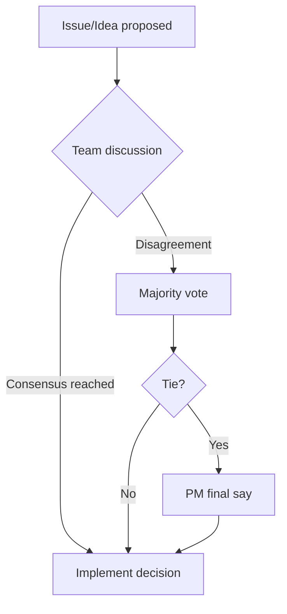

Diagram 2: Team 3's Decision-Making process

**7. Conflict Resolution**
1. Direct, respectful 1-on-1 discussion between conflicting members.
2. Mediation during a Scrum meeting with the whole team.
3. Escalation to the TA if no resolution is found, or if the issue threatens the project's success.

**8. Review and Update Process**
* This contract will be reviewed at the end of every Sprint. 
* Adjustments will be made if current tools, schedules, or plans are proving ineffective.

## E - Development Tools and Process Setup
*Performed by: Nguyễn Duy Đức, Reviewed by: Nguyễn Thúy Hằng, Edited by: Nguyễn Thúy Hằng*

Our team has set up the following tools as per PA1's requirements:

* **Moodle:** Monitored for PA submissions and guidelines.
* **Facebook group (or equivalent):** Class Discord server for discussions and correspondence/QnA's. See below:
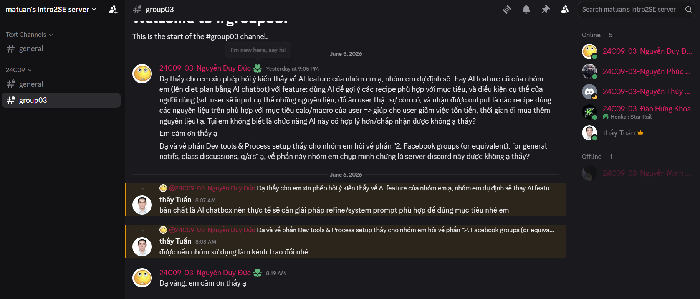
* ***Image E.1:** Screenshot of the class' Discord server.*

* **Communication tools:** Created group chats and servers for internal communication. See below:
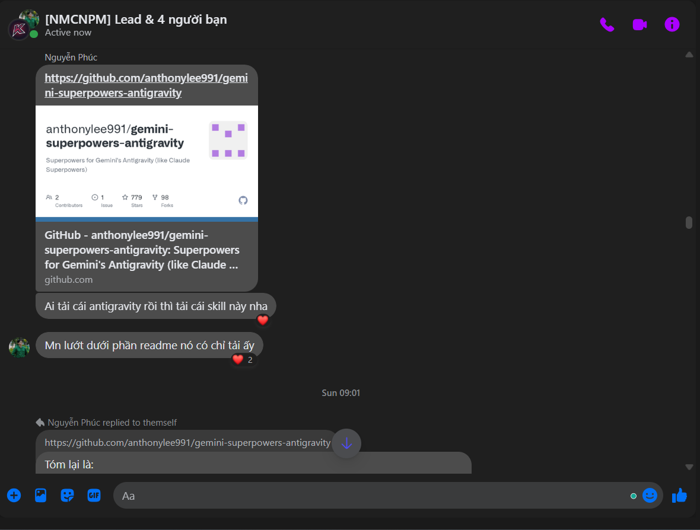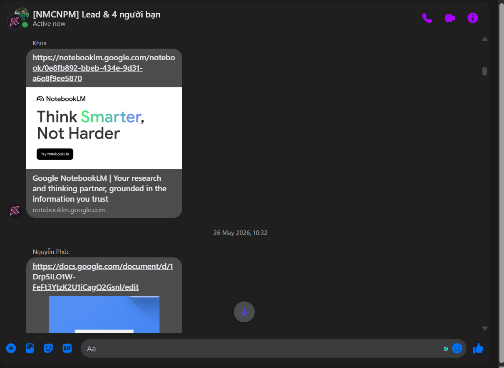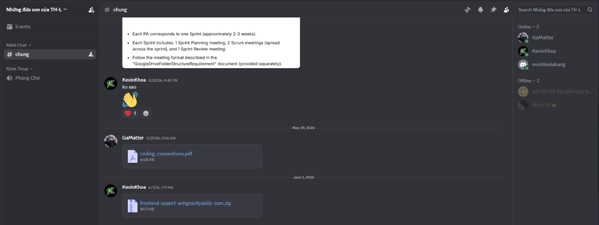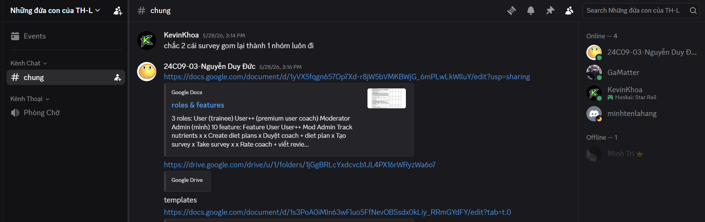
* ***Images E.2-3:** Screenshots of our team's Messenger group*
* ***Images E.4-5:** Screenshots of our team's Discord server*

* **Trello:** We've created a shared Trello board, with each card assigned to 1 person, each card having a valid Creation, Assignment, and Due date visible. See below:

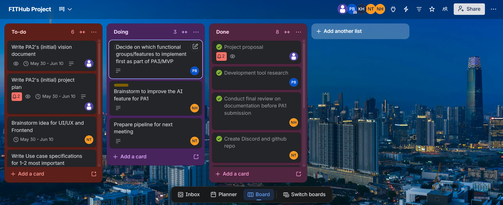
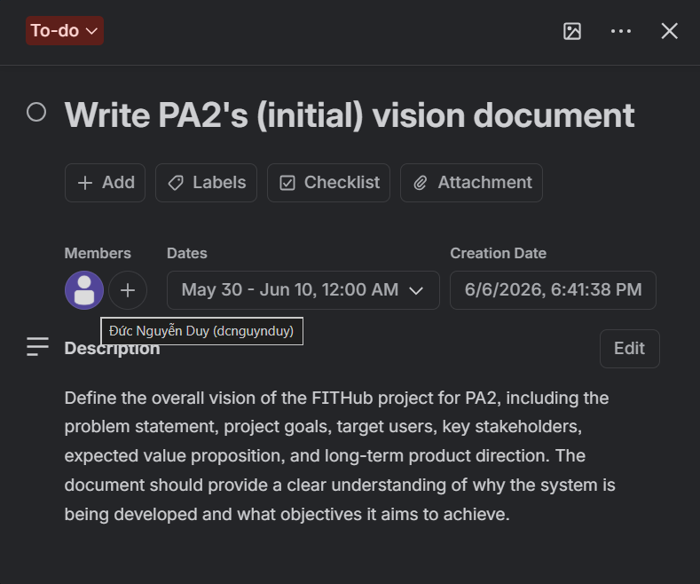
* ***Images E.6-7:** Screenshots of the team's Trello board and a sample card.*

* **Git (GitHub):** A private repository has been initialized with the required folder structure (`/src` and `/docs`). `.gitignore` is configured to prevent committing `.env` files or API keys. See below:
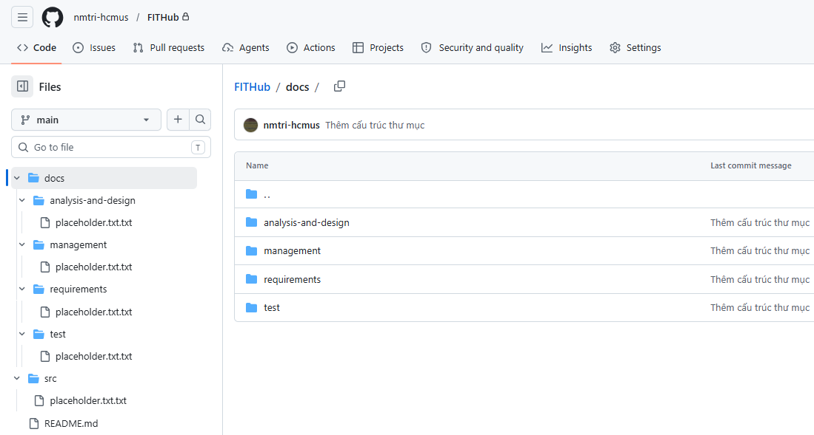
* ***Image E.8:** Screenshot of our project GitHub repo.*

* **Spec Kit:** Will be initialized in our next sprint.
* **AI Coding Accounts:** All members have registered and verified educational accounts for GitHub Copilot  to accelerate development workflows. See below: 
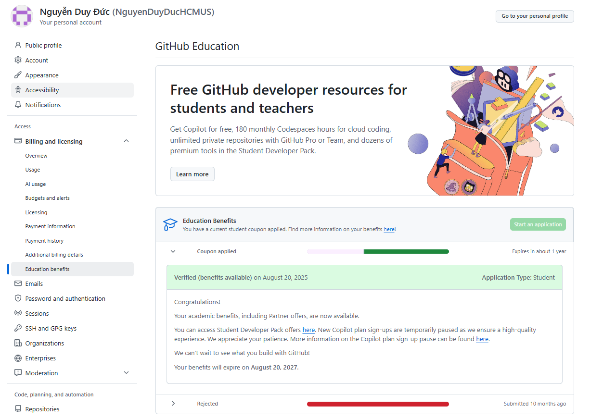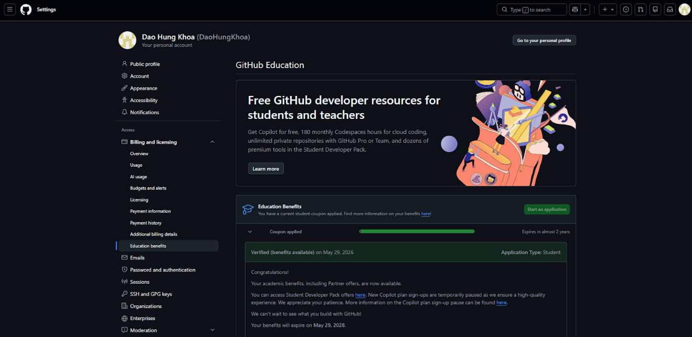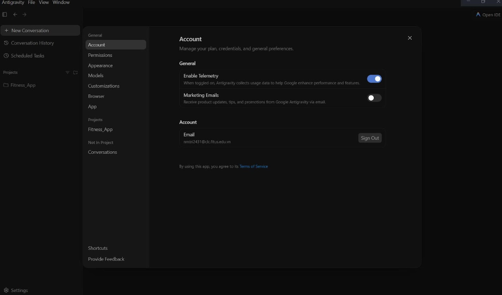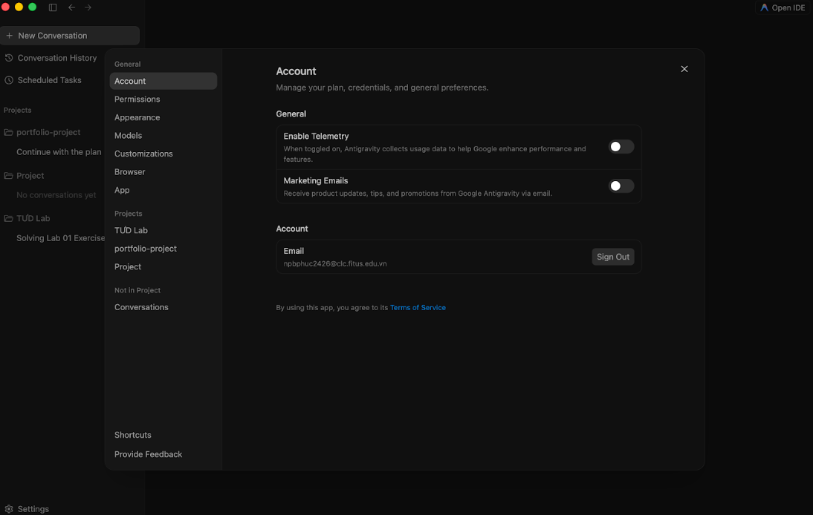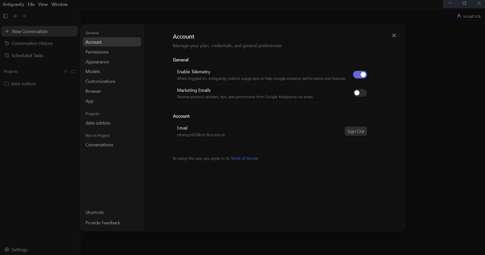
* ***Images E.9-13:** Screenshots of each member's AI coding agent (GitHub Education/Copilot: Đức, Khoa; Antigravity: Phúc, Trí, Hằng)*