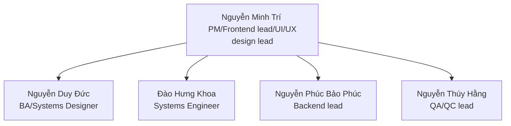
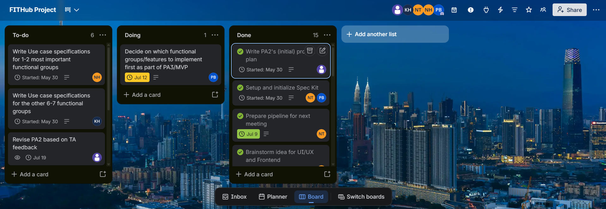
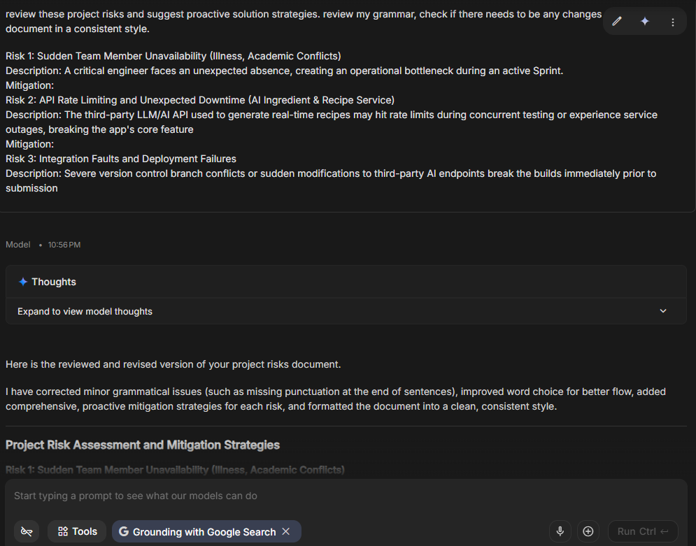

## 1. Introduction

> **Performed by:** Nguyễn Thúy Hằng | **Reviewed by:** Nguyễn Duy Đức  | **Edited by:** Nguyễn Duy Đức

FITHub is a web application that combines multiple health-centric functionalities to help users gain autonomy over their fitness and well-being. By bridging the gap between traditional workout/diet tracking and professional coaching approaches, our app aims to provide a more complete solution to health (both mental and physical) and fitness.

## 2. Project overview

> **Performed by:** Nguyễn Thúy Hằng | **Reviewed by:** Nguyễn Duy Đức  | **Edited by:** Nguyễn Duy Đức

- **Goals:** Successfully apply Agile/Scrum engineering methodologies to team development. Iteratively produce high-quality artifacts to pass every progressive assessment (PA) milestone. Successfully acquire and engage target user groups (fitness individuals and certified coaches) to validate the platform's real-world market value and operational feasibility.
- **Scope:** Development of the web application (mobile viewports for trainees and coaches; desktop views for admins/mods); integration of third-party LLM APIs for AI recipes; development of a relational database for food auditing.
- **Deliverables:** Software requirement specification (SRS) and software design document (SDD). Production-ready frontend and backend source code repositories hosted on GitHub. Comprehensive test suites (test plans, test cases, and reports). A complete FITHub application running successfully on a local deployment environment via localhost.
- **Assumptions:** All team members have registered student accounts for the AI tools and are able to use them on their personal computers. Third-party AI and cloud infrastructure APIs remain stable, providing adequate free-tier quotas suitable for academic project constraints.

## 3. Project organization

> **Performed by:** Nguyễn Thúy Hằng | **Reviewed by:** Nguyễn Duy Đức  | **Edited by:** Nguyễn Duy Đức

### 3.1. Team structure & role allocations

The team consists of 5 members distributed according to functional specializations under standard Scrum roles, as was allocated in PA1:

- **Nguyen Minh Tri** (PM / Frontend lead / UI/UX design lead): Facilitates Scrum ceremonies, administers the global project management boards, is responsible for the overarching UI/UX design, designs the responsive layout templates, and establishes the master frontend codebase. 
- **Nguyen Duy Duc** (BA / Systems designer): Conceptualizes and prioritizes the product backlog, authors core requirement specifications (vision, SRS), designs the overall system architecture, and models core domain workflows.
- **Dao Hung Khoa** (Systems engineer): Engineers the development environments, configures containerization, sets up automated testing hooks, and manages the implementation of database migrations and underlying system components.
- **Nguyen Phuc Bao Phuc** (Backend lead): Designs relational database schemas, establishes the backend development framework, manages API routing and integration pipelines, and oversees secure access mechanics.
- **Nguyen Thuy Hang** (QA/QC lead): Crafts the software verification and validation strategies, designs comprehensive test plans and test case specifications, executes continuous functionality reviews, and manages bug tracking.

### 3.2. Risk management

| Risk                                                            | Risk description                                                                                                                                                                                                                             | Solution                                                                                                                                                                                                                                                                                                                                                                                                                                                                  |
| --------------------------------------------------------------- | -------------------------------------------------------------------------------------------------------------------------------------------------------------------------------------------------------------------------------------------- | ------------------------------------------------------------------------------------------------------------------------------------------------------------------------------------------------------------------------------------------------------------------------------------------------------------------------------------------------------------------------------------------------------------------------------------------------------------------------- |
| Sudden team member unavailability (illness, academic conflicts) | A working/critical team member has an unexpected absence, creating an operational bottleneck during an active sprint and threatening PA deadlines.                                                                                           | We will enforce strict cross-training for all members to be competent in all necessary fields as full-stack engineers and ensure all code is heavily commented. If an absence occurs, the project manager will temporarily reassign their critical tasks to other members and drop/delay non-essential features to ensure the core MVP/most vital features is submitted on time                                                                                           |
| API rate limiting and unexpected downtime                       | The third-party LLM/AI API used to generate real-time recipes may hit rate limits during concurrent testing or experience service outages, breaking the app's core AI feature.                                                               | The team will use multiple API keys from different members to rotate if rate limits are hit. Additionally, the backend lead will implement hardcoded mock responses so that if the AI API crashes during a live demo, the application will still function without crashing.                                                                                                                                                                                               |
| Integration faults and deployment failures                      | Severe version control branch conflicts or sudden modifications to third-party AI endpoints break the builds immediately prior to the assignment submission.                                                                                 | We will work on implementing a strict Git workflow where all code must be submitted via pull requests and reviewed by at least one other member. We will also enforce a strict "code freeze" 48 hours before the PA deadline, dedicating the final two days purely to QA testing and bug fixing rather than adding new code.                                                                                                                                              |
| Requirement misalignment (stakeholder rejection)                | In the process of deployment or documentation, the advisors/instructors find the group's idea, or technical implementation unsatisfactory/mistaken in terms of scope or relevancy.                                                           | The PM/BA will consult with the TAs/instructors at the end of every sprint during the review phase to validate our app's progress. If feedback requires immediate overhaul, the team will immediately hold an emergency scrum to refine the features and adjust the spec kit requirements to suit stakeholder demands.                                                                                                                                                    |
| Scope creep                                                     | After each sprint, more and more features get added into the development plan by team members. These features are either too complex, unfeasible, or are unimportant to the long-term effectiveness of the app.                              | The team will strictly adhere to the MVP/current features defined in the PA2 vision document. Any new feature ideas proposed during the semester must be logged in a "backlog" on Trello, where the responsibility will fall on the PM to approve or check off each feature idea. The project manager will block any new features from entering the active sprint unless all core requirements for the current PA are 100% complete and tested, unless for special cases. |
| Internal conflicts                                              | During the developmental process, tensions may rise between team members/teams as a result of differing opinions/expectations/demands,.... This may lead to inner-team resentment/full-blown arguments, hampering the developmental process. | The team will strictly adhere to conflict resolution plan/scheme devised in PA1, if need be. Otherwise, responsibility falls upon the PM to prevent such events from happening by ensuring respectful communication and conflict resolution between team members and teams.                                                                                                                                                                                            |

## 4. Project plan

> **Performed by:** Nguyễn Thúy Hằng | **Reviewed by:** Nguyễn Duy Đức  | **Edited by:** Nguyễn Duy Đức
### 4.1. Execution model & sprint schedule 

The timeline is split into 5 consecutive, fixed-duration sprints. Each iteration spans 2 weeks and lines up with a formal PA submission to facilitate iterative verification. Our sprint is currently consistent with our Trello project dashboard (see below.) 

### 4.2. Build plan

The project follows an incremental build strategy with one build produced in each sprint. Every build will be tested before proceeding to the next sprint to ensure system stability and feature completeness.

| Build                       | Sprint         | Purpose                                          | Main contents                                                                             | Testing                                       |
| :-------------------------- | :------------- | :----------------------------------------------- | :---------------------------------------------------------------------------------------- | :-------------------------------------------- |
| **Build 1 (prototype)**     | Sprint 1 (PA1) | Establish the project foundation                 | Project setup, development environment, project skeleton                                  | Check the completion review                   |
| **Build 2**                 | Sprint 2 (PA2) | Validate core functionality                      | User registration and login, database integration, core business logic recommended in PA1 | Unit testing, integration testing             |
| **Build 3**                 | Sprint 3 (PA3) | Complete other major features recommended in PA2 | API integration, main features, UI improvements                                           | Functional testing, regression testing        |
| **Build 4**                 | Sprint 4 (PA4) | Prepare release candidate                        | Complete feature set, performance optimization, bug fixes                                 | System testing, user acceptance testing (UAT) |
| **Build 5 (final release)** | Sprint 5 (PA5) | Final project delivery                           | Final application, documentation, deployment package                                      | Final regression testing, acceptance testing  |

### 4.3. Build strategy

- A build will be generated at the end of every sprint.
- Each build must successfully compile and pass the required automated and manual tests before release.
- Critical bugs discovered during testing must be fixed before the next sprint begins.
- Every build will be tagged in GitHub with each branch.
- Trello tasks associated with each build must be completed and reviewed before the build is released.

### 4.4. Version history

| Version | Build   | Description                                            |
| :------ | :------ | :----------------------------------------------------- |
| **v1**  | Build 1 | Initial project skeleton and prototype                 |
| **v2**  | Build 2 | Core functionality implemented                         |
| **v3**  | Build 3 | Most planned features completed                        |
| **v4**  | Build 4 | Release candidate after bug fixing and optimization    |
| **v5**  | Build 5 | Final version for project demonstration and submission |

# Appendix: AI Usage Notes

*   **Tool name, version, and platform:** Gemini 3.1 Pro (Google AI Studio)
*   **Access time:** July 10, 2026, 20:00
*   **Prompts used:** "review these project risks and suggest proactive solution strategies. review my grammar, check if there needs to be any changes and format my document in a consistent style."
*   **Purpose of use:** To check our grammar and suggest structural improvements for our Risk Management section and the whole project plan as a whole.
*   **Which content was generated by AI:** Suggestions for proactive mitigation strategies (code freezes).
*   **Which content was done independently and how the student edited or validated it:** The team independently identified the risks. AI suggestions were reviewed, and only those applicable to our 5-person team constraints were manually rewritten in our own words into the document.
*   **Screenshots or chat history:** 

## Acknowledgements:

* In addition to the aforementioned instances of AI assistance, we are also very grateful for our upperclassmen (Luong Quoc Dung, Nguyen Minh Hoang, Nguyen Quang Huy, Tran Nguyen Phuc Khang, and Tran Ngoc Uyen Nhi) for their invaluable resources.
* For our project plans specifically, we've taken inspiration from how they wrote/described their team structures, and their build plan.