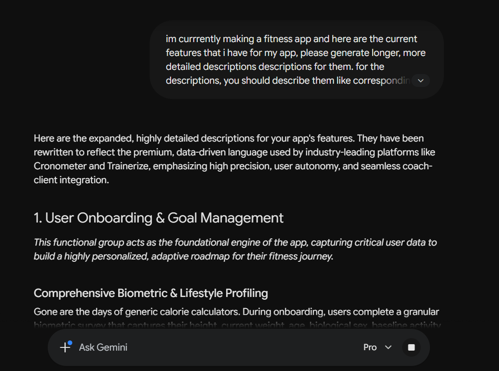
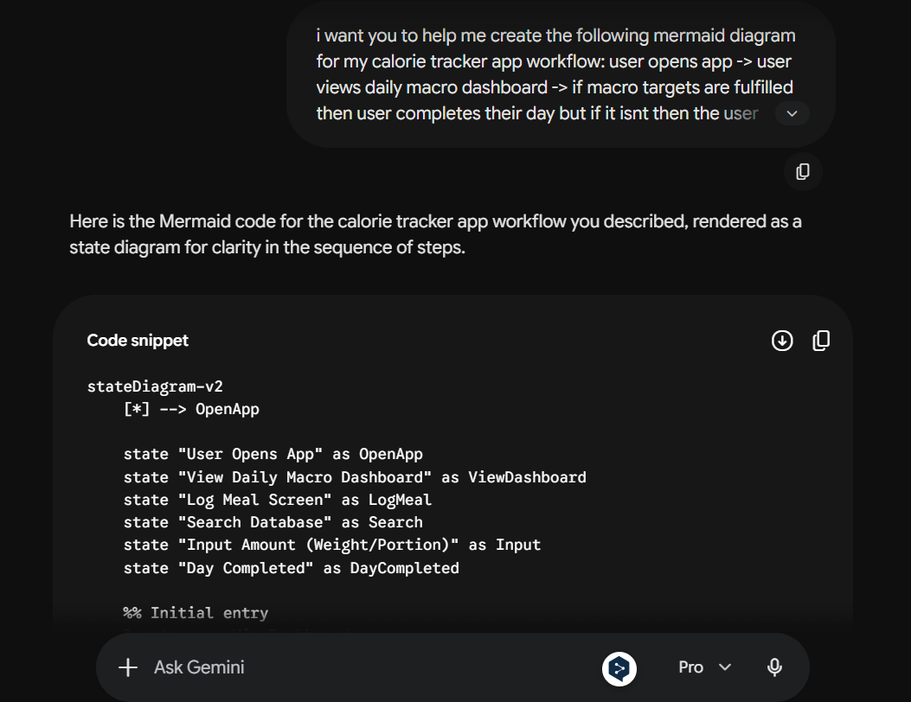
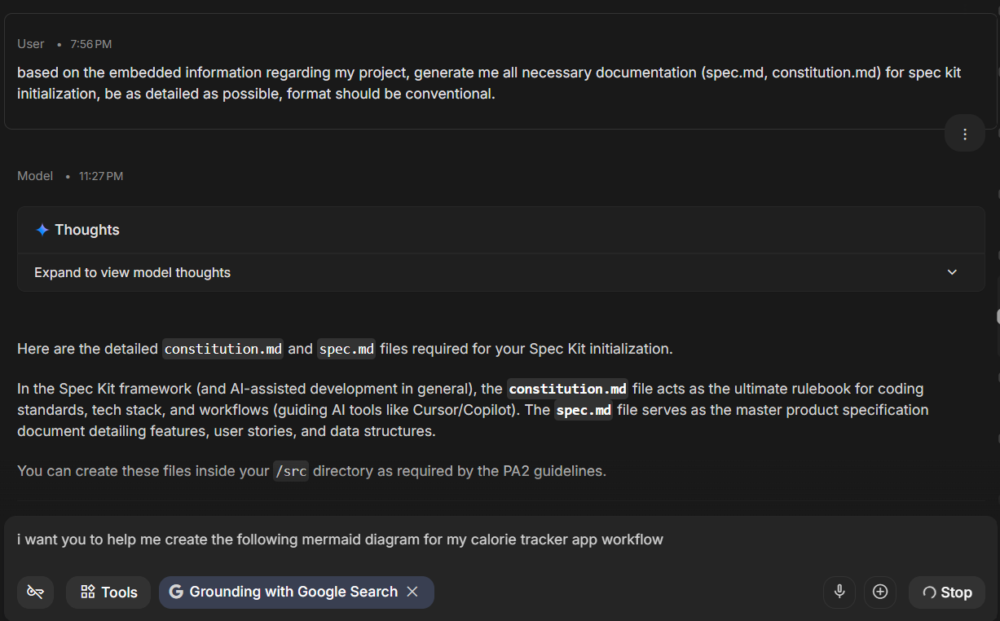

**Team Name:** Group 05
**Sprint:** 2 
**Declaration:** During Sprint 2, our team utilized AI tools (primarily Gemini 3.1 Pro) for structuring + formatting documents, grammar checks, help with spec kit initialization and for help with Mermaid graphs. 

---

## 1. AI Usage for the Vision Document

**Tool name, version, and platform:** Gemini 3.1 Pro
*   **Access time:** July 5 - July 6, 2026
*   **Prompts used:** 
	* "im currrently making a fitness app and here are the current features that i have for my app, please generate longer, more detailed descriptions descriptions for them. for the descriptions, you should describe them like corresponding features for cronometer, or trainerize as those are the main inspirations for our app."
	* "i want you to help me create the following mermaid diagram for my calorie tracker app workflow: user opens app -> user views daily macro dashboard -> if macro targets are fulfilled then user completes their day but if it isnt then the user clicks a button to log their meal in the correct meal type (breakfast, lunch, dinner, snack) -> user search through the database to find their meal/meal's ingredients -> user inputs each ingredient/meal by weight or portion ->   dashboard updates "
*   **Purpose of use:** To structure paragraphs for readability and learn Mermaid syntax.
*   **Which content was generated by AI:** Paragraph structures, transition words, and Mermaid syntax templates.
*   **Which content was done independently and how the student edited or validated it:** The team independently brainstormed all feature logic and workflow steps. AI outputs were heavily edited to remove exaggerations and ensure factual accuracy regarding the FITHub project. 
*   **Screenshots or chat history:** 

---

## 2. AI Usage for the Project Plan

**Tool name, version, and platform:** Gemini 3.1 Pro (Google AI Studio)
*   **Access time:** July 10, 2026, 20:00
*   **Prompts used:** "review these project risks and suggest proactive solution strategies. review my grammar, check if there needs to be any changes and format my document in a consistent style."
*   **Purpose of use:** To check our grammar and suggest structural improvements for our Risk Management section and the whole project plan as a whole.
*   **Which content was generated by AI:** Suggestions for proactive mitigation strategies (code freezes).
*   **Which content was done independently and how the student edited or validated it:** The team independently identified the risks. AI suggestions were reviewed, and only those applicable to our 5-person team constraints were manually rewritten in our own words into the document.
*   **Screenshots or chat history:** 

---

## 3. AI Usage for Spec Kit Initialization

### Entry 3.1: Spec.md Boilerplate Generation
*   **Tool name, version, and platform:** Gemini 3.1 Pro (Google AI Studio)
*   **Access time:** July 8, 2026, 21:00
*   **Prompts used:** "based on the embedded information regarding my project, generate me all necessary documentation (spec.md, constitution.md) for spec kit initialization, be as detailed as possible, format should be conventional."
*   **Purpose of use:** Code suggestion to speed up writing the technical specification files required by spec kit initialization.
*   **Which content was generated by AI:** The basic TypeScript interface syntax and standard data types (`string`, `number`).
*   **Which content was done independently and how the student edited or validated it:** When Gemini suggested the interface, we manually checked it to ensure it linked correctly to our `User` ID and included our specific enums for `mealType`. We went through 2 different iterations, and decided on the latter one.
*   **Screenshots or chat history:** 
