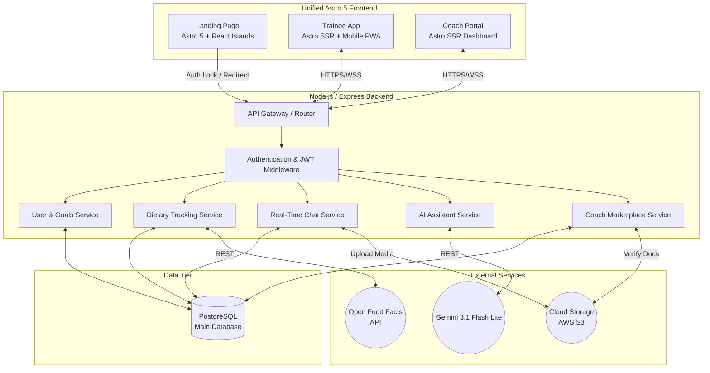

# FITHub - System Architecture Document

**Version 1.1**

## 1. Architectural Overview
FITHub utilizes a **Client-Server, Service-Oriented Architecture (SOA)** with a **Split Frontend Design**. 

To maximize SEO and initial load speeds, the unauthenticated landing page uses a static generator with selective hydration. The authenticated core application uses a robust Progressive Web App (PWA) framework. The backend handles business logic, relational data persistence, and secure communication with external APIs.

### 1.1 Technology Stack (Optimized Unified Architecture)
| Layer                    | Technology                                               | Justification                                                                                                                                                                            |
| :----------------------- | :------------------------------------------------------- | :--------------------------------------------------------------------------------------------------------------------------------------------------------------------------------------- |
| **Unified Frontend**     | Astro 5, React Islands, Tailwind CSS v4, Framer Motion   | Single-codebase architecture. Ships 0 KB of JS for the landing page. Uses Astro 5 SSR (Server-Side Rendering) for authenticated routes (`/login`, `/survey`, `/dashboard`) and React Islands for complex UI states. |
| **Backend (API)**        | Node.js with Express.js, Socket.io                       | Express handles standard HTTP REST requests. Socket.io enables real-time, bi-directional communication for the 1-on-1 coaching chat.                                                     |
| **Database**             | PostgreSQL                                               | Relational data model is perfect for strict data linking (e.g., matching users to specific logs, tracking macro aggregates).                                                             |
| **External APIs**        | Open Food Facts (OFF), Gemini 3.1 Flash Lite             | OFF provides raw ingredient data. Gemini provides the fast, lightweight LLM logic for the AI chatbot assistant.                                                                          |
| **OCR**                  | Tesseract.js                                             | Open-source OCR library running on Node.js. Parses nutritional labels and barcode images server-side without requiring paid cloud vision APIs.                                           |
| **Cloud Storage**        | Cloudinary / AWS S3                                      | Stores heavy media files (chat images, form-check videos) to prevent PostgreSQL database bloat.                                                                                          |

---

## 2. High-Level System Architecture Diagram
*The following diagram illustrates how data flows between the split frontends, our internal backend/database, and external third-party services.*

---

## 3. Core System Modules (Backend Services)
To satisfy the functional groups outlined in the Vision Document, the backend architecture is divided into the following logical service modules:

### 3.1 User & Goals Service
*   **Responsibilities:** Handles SSO (Google/Apple) and standard JWT authentication. Processes the initial biometric survey to calculate target macros.
*   **Database Interaction:** Manages the `users` and `biometric_history` tables.

### 3.2 Dietary & Tracking Service (Hybrid Pattern)
*   **Responsibilities:** Handles food searching, meal logging, macro aggregation, and nutritional label OCR scanning.
*   **External Integration:** Proxies search queries from the frontend to the **Open Food Facts API**. 
*   **OCR Integration:** Uses **Tesseract.js** on the Node.js backend to parse nutritional label images uploaded by users, extracting calorie and macro data without requiring paid cloud vision APIs.
*   **Data Integrity:** When a user logs a meal, this service captures a "snapshot" of the OFF data and saves it permanently to PostgreSQL.

### 3.3 AI Assistant Service
*   **Responsibilities:** Acts as the secure middleman between the user and **Gemini 3.1 Flash Lite**. 
*   **Security & Prompt Engineering:** The frontend never holds the Gemini API key. The frontend sends available ingredients and remaining macros to this service, which injects them into a strict system prompt (e.g., *"Generate a recipe under 400 calories using only these ingredients"*) before querying Gemini.

### 3.4 Coach Marketplace Service
*   **Responsibilities:** Manages coach profiles, handles matchmaking logic, and oversees the rating system. Also provides the administrative endpoints for automated word-filtering in coach bios.

### 3.5 Real-Time Communication Service (1-on-1 Portal)
*   **Responsibilities:** Facilitates the 1-on-1 messaging between coach and trainee.
*   **Protocol:** Uses WebSockets (via Socket.io) to allow for instant, real-time message delivery.
*   **Media Handling:** Securely routes workout form-check videos and chat photos to Cloud Storage (S3).

---

## 4. Key Architectural Trade-offs & Decisions

1. **Unified Frontend Architecture (Astro 5):**
   * *Decision:* We opted to build the entire application, including the marketing landing page and the core logged-in dashboard, using **Astro 5 + React Islands**.
   * *Justification:* A unified architecture simplifies development and maintenance. Astro allows us to ship 0 KB of JavaScript for the static layout of the landing page to convert visitors successfully, while leveraging Astro's SSR and React Islands for the complex interactive state needed in the authenticated dashboards (`/login`, `/survey`, `/dashboard`). This eliminates the need to manage a separate heavy SPA framework like Next.js.
2. **Cloud Storage for Media vs. PostgreSQL Bloat:**
   * *Decision:* Even though we removed public user progress photos, we are retaining a dedicated Cloud Storage bucket (AWS S3/Cloudinary) for the 1-on-1 chat portal.
   * *Justification:* Users will send workout form-check videos and meal photos in the coach chat. Storing binary media files (BLOBs) directly in PostgreSQL is a severe anti-pattern that slows down query speeds and unnecessarily inflates database costs. The system will upload the media to S3, and PostgreSQL will only store the lightweight URL string (e.g., `https://s3.aws.com/fithub/chat/video123.mp4`).
   3. **Server-Side API Proxying:**
   * *Decision:* The frontend client will never communicate directly with Open Food Facts or the Gemini API. 
   * *Justification:* Routing all external API requests through our Node.js backend hides our private API keys, allows us to implement rate-limiting, and prevents CORS errors in the browser.