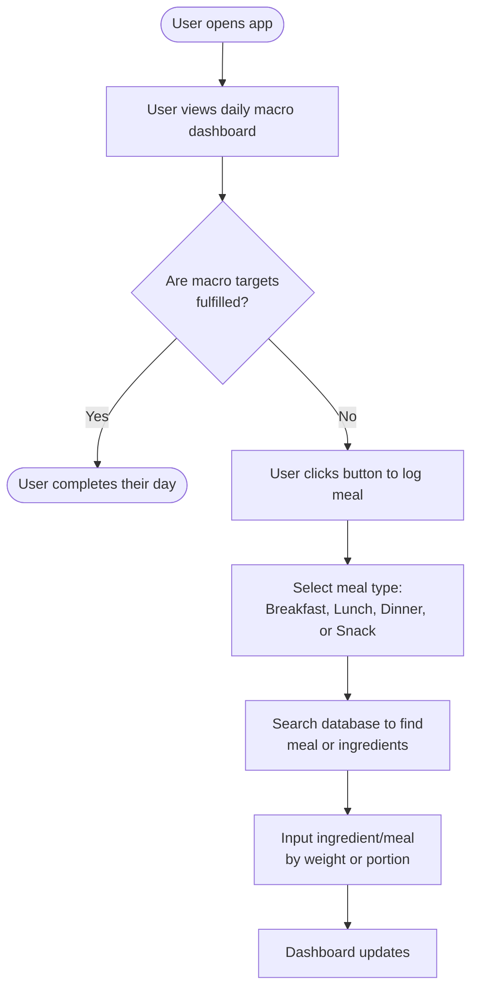
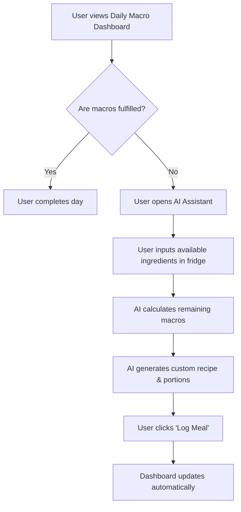
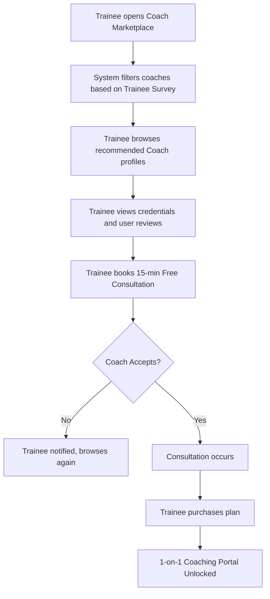

# FITHub - Vision document

**Version 1.0**

*Performed by: Nguyễn Duy Đức, Reviewed by: Nguyễn Minh Trí, Edited by: Nguyễn Minh Trí*

## 1. Introduction 
**Purpose of the document:** This document aims to provide an overview of the FITHub application. It defines the core problems the application aims to solve, outlines the target user base, and details the overarching functional and non-functional requirements. It serves as the foundational blueprint for the development team, stakeholders, and instructors to ensure a unified understanding of the project's scope before implementation begins.

---

## 2. Positioning 
*Performed by: Nguyễn Duy Đức, Reviewed by: Nguyễn Minh Trí, Edited by: Nguyễn Minh Trí*
### 2.1 Problem statement

| **The problem of**                 | the heavy fragmentation of digital fitness and health tools (specifically: calorie/nutrient tracking apps and exercise coaching applications).                                                                                                                                            |
| :--------------------------------- | :---------------------------------------------------------------------------------------------------------------------------------------------------------------------------------------------------------------------------------------------------------------------------------------- |
| **affects**                        | health-conscious individuals, people wishing to manage/reverse preexisting medical conditions, and certified coaches/personal trainers                                                                                                                                                    |
| **the impact of which is**         | users experience a latency/extra barrier to their coaching/fitness as a result of having to switch between separate apps for calorie tracking, recipe finding, and coaching. This leads to poor discipline, inaccurate progress tracking, and miscommunication between coach and trainee. |
| **a successful solution would be** | an all-in-one platform that seamlessly integrates precise dietary tracking, AI-assisted meal planning, and a dedicated 1-on-1 coaching portal, allowing users to manage their entire fitness journey in a single app ecosystem.                                                           |

### 2.2 Product position statement

| **For**              | Health-conscious individuals, trainees, and certified personal trainers.                                                                                                                                         |
| :------------------- | :--------------------------------------------------------------------------------------------------------------------------------------------------------------------------------------------------------------- |
| **Who**              | Needs a unified way to track macronutrients/nutritional information, plan meals, and manage exercise coaching.                                                                                                   |
| **The product name** | FITHub                                                                                                                                                                                                           |
| **That**             | Combines an advanced dietary tracker with an AI-powered nutritional assistant and a robust coach browsing marketplace, with relevant   recommendations.                                                          |
| **Unlike**           | MyFitnessPal, Cronometer (which lacks professional coach integration) and Trainerize (which lacks native food tracking and open community databases).                                                            |
| **Our product**      | Bridges the gap by providing an all-in-one ecosystem where users can hire a coach, track their daily meals, and use AI to generate recipes based on their remaining macros, all within the exact same workspace. |

---

## 3. Stakeholder and user descriptions 
*Performed by: Nguyễn Duy Đức, Reviewed by: Nguyễn Minh Trí, Edited by: Nguyễn Minh Trí*

### 3.1 Stakeholder summary
| Name                  | Description                                                                 | Responsibilities                                                                                                                                            |
| :-------------------- | :-------------------------------------------------------------------------- | :---------------------------------------------------------------------------------------------------------------------------------------------------------- |
| **Development team**  | The 5 students of FITHub project group.                                     | Responsible for designing, implementing, testing, and deploying the FITHub application within the alloted timeframe.                                        |
| **Instructors / TAs** | Intro to Software Engineering (CSC13002) lecturers and teaching assistants. | Evaluate the project's adherence to software engineering processes, provide technical feedback, and grade the end products.                                 |
| **Platform owner**    | The administrative head of FITHub                                           | Provides constructive criticism/feedback, in charge of business logic, manages platform revenue/costs (API keys, quotas,...), and oversees platform growth. |

### 3.2 User summary
| Name                | Description                                                                                        | Responsibilities / Usage                                                                                             |
| :------------------ | :------------------------------------------------------------------------------------------------- | :------------------------------------------------------------------------------------------------------------------- |
| **Trainee (User)**  | Represents interested people seeking to improve their fitness, lose/gain weight, or manage health. | Log daily meals, update body weight, prompt AI assistant for recipes, or browse community recipes, and hire coaches. |
| **Coach (Trainer)** | Represents certified fitness professionals offering services.                                      | Create custom diet/workout plans for clients, monitor trainee progress, and communicate via the 1-on-1 portal.       |
| **Moderator/admin** | Represents software/project quality assurance staff.                                               | Verify coach certification documents, moderate community recipe submissions, and handle user dispute reports.        |
| **Guest user**      | Represents unregistered users.                                                                     | Can view the landing page and basic public community recipes to understand the app's value before signing up.        |

### 3.3 User environment
FITHub will be built as a Progressive Web Application (PWA). 
* **Trainees and coaches** will primarily interact with the application via mobile web browsers (Safari, Chrome) to allow for on-the-go food logging and quick gym check-ins. 
* **Moderators and admins** will primarily utilize desktop web browsers (Chrome, Edge, Firefox) to efficiently view complex data tables, moderate databases, and verify coaching certificates on larger screens.
* The system requires a stable internet connection to sync tracking data and utilize the AI generation features.
*  Our rationale behind developing FITHub as a PWA is to leave room for future expansion/growth into a discrete mobile application, as a mobile app FITHub will primarily be used by trainees and coaches; moderators and admins will continue to primarily use desktop web browsers for their administrative/developmental work.

### 3.4 Summary of key stakeholder/user needs
| Need                        | Priority | Concerns                                                       | Current solution                                                                                                   | Proposed solution                                                                                      |
| :-------------------------- | :------- | :------------------------------------------------------------- | :----------------------------------------------------------------------------------------------------------------- | :----------------------------------------------------------------------------------------------------- |
| **Accurate macro tracking** | High     | Needs to be fast and frictionless to maintain user habits.     | Using external apps like Cronometer.                                                                               | Integrated food database with barcode/camera scanning for instant logging.                             |
| **Professional coaching**   | High     | Needs verified, trustworthy coaches and clear communication.   | Finding coaches on Instagram and chatting via 3rd party messaging/coaching apps like Zalo/Messenger or Trainerize. | Built-in Coach Marketplace with verified reviews and a dedicated 1-on-1 portal.                        |
| **Recipe curation & math**  | Medium   | Calculating remaining macros at the end of the day is tedious. | Searching Google for recipes and guessing portion sizes.                                                           | An AI Assistant that actively generates recipes tailored exactly to the user's remaining daily macros. |
| **Platform safety**         | High     | Preventing fake coaches and inaccurate food data.              | Unmoderated databases (like MyFitnessPal) full of junk data/recipes.                                               | Admin dashboards for mandatory Coach ID verification and community recipe approval.                    |

### 3.5 Alternatives and competition

| Alternatives/competitors | Pros                                              | Cons                                                                                                                                    |
| ------------------------ | ------------------------------------------------- | --------------------------------------------------------------------------------------------------------------------------------------- |
| **MyFitnessPal**         | Decent for generic calorie counting               | Custom user food entries are inaccurate. Also offers no support for interacting with human personal trainers.                           |
| **Cronometer**           | Accurate + detailed macro/micronutrient tracking  | has no support for coaching, and no AI-assisted recipe generation to  help users figure out what to eat to achieve targets.             |
| **Trainerize**           | Industry standard app for coach-client management | lacks a built-in food database, forcing coaches to ask clients to track food on other apps and send screenshots, causing user friction. |
|                          |                                                   |                                                                                                                                         |

---

## 4. Product overview

### 4.1 Product perspective 
FITHub is a standalone web-based ecosystem. The frontend will be designed with a mobile-first approach to act as a PWA, ensuring it feels like a native app on smartphones. Of course, if possible, our team will try to expand the FITHub application from mobile web app form into native mobile app form, but this is only a secondary concern currently. The system will interface with a cloud database to store user biometrics, food logs, and chat histories. Furthermore, the application relies on external API integrations, specifically an AI large language model (Gemini Flash) to power the smart recipe generation chatbot feature.

### 4.2 Assumptions and dependencies
*   **Assumptions:** Users possess a basic understanding of macronutrients (Protein, fat, carb/PFC) and caloric intake. The target users has access to a smartphone with a functional camera for barcode/food scanning.
*   **Dependencies:** The AI assistant's functionality is entirely dependent on the uptime and response time of the chosen third-party cloud database and AI API (Gemini). The app requires standard modern web browsers to function correctly. 

---

## 5. Product features
*Performed by: Nguyễn Duy Đức, Reviewed by: Nguyễn Minh Trí, Edited by: Nguyễn Minh Trí*
### 5.1 User onboarding & goal management
This functional group handles the initial data gathering and long-term goal setting required to personalize the app for each user.

*   **Comprehensive biometric survey:** Users complete an initial survey detailing their height, weight, medical conditions, and activity levels. This serves as the data estimation for the app to automatically calculate their baseline caloric and macronutrient targets. This feature is specifically beneficial for beginners who are still unsure of their targets/biomarkers (basal metabolic rate, PFC balance,..) either due to inexperience or lack of equipment.
*   **Dynamic goal adjustment:** The app recalculates target macros and calories dynamically as the user updates their current body weight over time. This is done so as to ensure that the user will hit their targets as their bodies adapt to their new lifestyles. This ensures that the user's diet plan remains highly optimized and accurate across long-term fitness journeys (like a 6-month weight loss phase).
*   **Visual progress & measurement tracker:** Users can log their daily body weight, body fat percentage, and upload periodic physique check-in photos. This creates a visual timeline of their transformation, boosting motivation and providing coaches with necessary visual data. Certain data (like BW, BF%) can be presented in the form of multiple specialized graphs showing important trends like Cronometer's pro graphs.

### 5.2 Dietary & nutritional tracking
This core functional group provides the daily tools necessary for users to monitor their food intake with high precision.

*   **Comprehensive meal logging:** Users can search an extensive food database to manually log individual ingredients or entire meals they have consumed. This provides users with high accuracy over tracking their specific dietary targets.
*   **Visual macro/micronutrient dashboard:** The app displays daily progress using charts (pie charts, progress bars like in Cronometer) for macronutrients and specific micronutrients. This allows users, especially those managing health conditions like diabetes, to easily monitor their nutritional targets/limits at a glance.
*   **Barcode & smart camera logging:** Users can scan barcodes or snap photos of nutritional labels to automatically input the data via OCR (Optical Character Recognition). This heavily reduces the friction and tedium of manual data entry, making daily tracking highly convenient.

### 5.3 Diet plan & recipe management
This group focuses on the scheduling, organization, and community sharing of daily diet plans and meals.

*   **Interactive diet calendar:** Diet plans are visualized in a chronological calendar where users can schedule, view, or modify their meals for the week. This provides a clear, organized timeline of their upcoming diet regimen and historical adherence.
*   **Community recipe templates:** Users can create custom meal recipes, save them for private use, or submit them to a public database. This fosters a community-driven ecosystem where users can discover new, macro-friendly dishes created by others.
*   **Automated grocery list generator:** This feature compiles all the ingredients needed for a user's scheduled weekly diet calendar into a single, convenient checklist. This saves users massive amounts of meal-prep planning time and prevents overspending at the supermarket.

### 5.4 AI assistant & smart automation
This group includes the app's advanced AI capabilities, transforming it from a simple tracker into an active fitness assistant. This group may be expanded upon in the future, equipping FITHub with even greater AI capabilities

*   **AI-powered recipe generation:** Users can interact with an AI chatbot to curate recipes based on their remaining daily macros and what ingredients they currently have on hand. This drastically reduces the cognitive load of doing "macro-math" and helps users minimize food waste.
### 5.5 Coach marketplace & discovery
This functional group acts as the e-commerce and matchmaking bridge between independent trainees and professional coaches.

*   **Intelligent coach matchmaking:** Utilizing data from the user's initial onboarding survey, the system recommends specific coaches who specialize in those exact fitness or medical needs. This prevents beginners from feeling overwhelmed and connects them with the right professional instantly.
*   **Coach browsing & review system:** Trainees can browse a directory of certified coaches, view their credentials, and read verified reviews left by previous clients. This transparent rating system empowers users to make informed financial decisions and prevents potential scams.
*   **Free consultation booking:** Enables trainees to schedule a brief, 15-minute introductory chat with a coach before committing to a paid subscription plan. This reduces user hesitation and ensures a good personality and goal fit between the trainee and the trainer.

### 5.6 1-on-1 coaching portal
Once a trainee hires a coach, this functional group provides the secure, dedicated workspace for their professional relationship.

*   **Custom plan assignment:** Coaches can create and directly send customized fitness routines and specific meal instructions to a trainee's personal calendar. This allows trainers to actively manage their client's regimen without relying on messy external spreadsheets.
*   **Trainee progress monitoring:** Coaches are granted access to view their client's daily logged meals, macro completions, and biometric updates. This centralized data allows coaches to accurately evaluate plan adherence and make real-time adjustments.
*   **Direct messaging & video form-check:** The portal features a secure chat system where users can communicate and upload short video clips of their workouts. This allows coaches to review exercise form and provide specific, remote feedback to ensure the trainee's safety.

### 5.7 Social & community engagement
This group provides features designed to boost user retention, motivation, and interaction outside of professional coaching.

*   **Community forums & Q&A:** A dedicated space where users can ask fitness questions, share advice, and discuss diet strategies with other members and verified coaches. This builds a strong sense of community and provides free, crowdsourced knowledge to beginners.
*   **Fitness challenges & leaderboards:** Users can opt into monthly community challenges (e.g., "Log meals for 30 days straight") and view their ranking against others. This introduces gamification to the app, significantly increasing user retention and daily app engagement.
*   **Progress sharing integration:** Allows users to easily generate aesthetic summary graphics of their macro achievements or weight-loss milestones to share on social media. This serves as both a personal motivation booster and organic marketing for the FITHub platform.
* **Sub-communities:** Taken inspiration from Facebook's Groups (communities); this will be a dedicated space where users can apply to create community groups/clubs of interested health-oriented hobbyists in a local area (HCMC/Quy Nhon Hiking, Running, ... for example). Groups must first be validated by moderators before going into use. This will help users build a real sense of community, motivation, and aid in their overall health and adherence to long-term fitness goals. 

### 5.8 Platform moderation & administration
This group contains the essential, backend tools for Admins and Moderators to maintain platform integrity, revenue, and user safety.

*   **Coach verification system:** Moderators can review submitted personal IDs and coaching certifications from users applying for the "Coach" role. This ensures that only qualified professionals are allowed to charge trainees, maintaining the app's strict credibility.
*   **Community recipe moderation:** Admins and Mods review user-submitted recipes before they are pushed to the global app database. This prevents the public database from being polluted with inaccurate, duplicate, or harmful nutritional entries.
*   **Dispute resolution & reporting center:** Provides a structured, secure way for trainees to report inappropriate behavior, unfulfilled services, or harassment directly to the admin team. This guarantees a safe environment for all users and ensures strict accountability across the platform.
* **Wordfilter/Automatic censoring:** An automatic word filtering system will be put in place for group (Subcommunity) messages, and Coach bios/descriptions. This will primarily be used to prevent the proliferation of profanity, unsanitary/offensive language and speech as well as prevent potentially harmful endorsements/advertisements and spam. This will make FITHub a safer environment for users, and discourage harmful behavior.  

### 5.9 Representative workflows 

**Workflow 1: Food logging**

**Workflow 2: AI recipe generation**

**Workflow 3: Coach matchmaking & booking**

---

## 6. Non-functional requirements
*Performed by: Nguyễn Duy Đức, Reviewed by: Nguyễn Minh Trí, Edited by: Nguyễn Minh Trí*

*   **Performance:** 
    *   The application must load the initial dashboard in `< 2.5 seconds` on standard 4G networks, to ensure on-the-go usability for both coaches and trainees.
    *   AI Chatbot query responses must be generated and returned in `< 5 seconds`.
    *   The system must smoothly support up to `100 concurrent users` without noticeable latency in the chat portal.
*   **Availability & reliability:** 
    *   The database and core web hosting must maintain an uptime of `99.9%`.
    *   In the event of a server crash, the system must recover and restart within `< 10 seconds`.
*   **Security:**
    *   All user passwords must be hashed using `bcrypt` (or equivalent) before database insertion.
    *   Coach verification documents (IDs, Certificates) must be stored in secure, private cloud buckets and deleted immediately after moderator approval or rejection.
*   **Usability:** 
    *   `90%` of users must be able to successfully log a meal or initiate a chat within `3 clicks` from the home screen.
    *   The UI must be fully responsive, scaling flawlessly on devices ranging from `375px width` (mobile) to `1920px width` (desktop monitors).
* **Industry Standards:** 
	* **Accessibility standards:** Added compliance with WCAG 2.1 AA guidelines (high contrast, screen-reader compatibility).
	* **Coding Standards:** Enforced TypeScript strict mode, ESLint, and Prettier formatting as defined in our Spec Kit Constitution.
	* **API Standards:** Declared adherence to RESTful architecture and JSON data formatting.
	* **Browser Standards:** Specified cross-browser compatibility requirements (Chromium 100+, Safari 16+, Firefox 100+).
	* **Data Standards:** Added data privacy regulations regarding user health metrics and secure password hashing (bcrypt).

---
# Appendix: 

## AI Usage Notes

*   **Tool name, version, and platform:** Gemini 3.1 Pro
*   **Access time:** July 5 - July 6, 2026
*   **Prompts used:** 
	* "im currrently making a fitness app and here are the current features that i have for my app, please generate longer, more detailed descriptions descriptions for them. for the descriptions, you should describe them like corresponding features for cronometer, or trainerize as those are the main inspirations for our app."
	* "i want you to help me create the following mermaid diagram for my calorie tracker app workflow: user opens app -> user views daily macro dashboard -> if macro targets are fulfilled then user completes their day but if it isnt then the user clicks a button to log their meal in the correct meal type (breakfast, lunch, dinner, snack) -> user search through the database to find their meal/meal's ingredients -> user inputs each ingredient/meal by weight or portion ->   dashboard updates "
*   **Purpose of use:** To structure paragraphs for readability and learn Mermaid syntax.
*   **Which content was generated by AI:** Paragraph structures, transition words, and Mermaid syntax templates.
*   **Which content was done independently and how the student edited or validated it:** The team independently brainstormed all feature logic and workflow steps. AI outputs were heavily edited to remove exaggerations and ensure factual accuracy regarding the FITHub project. 
*   **Screenshots or chat history:** 

## Acknowledgements:

* In addition to the aforementioned instances of AI assistance, we are also very grateful for our upperclassmen (Luong Quoc Dung, Nguyen Minh Hoang, Nguyen Quang Huy, Tran Nguyen Phuc Khang, and Tran Ngoc Uyen Nhi) for their invaluable resources.
* Namely, in this document, we've been greatly inspired by their own vision document, especially their Positioning, and Stakeholder and User Descriptions description tables.